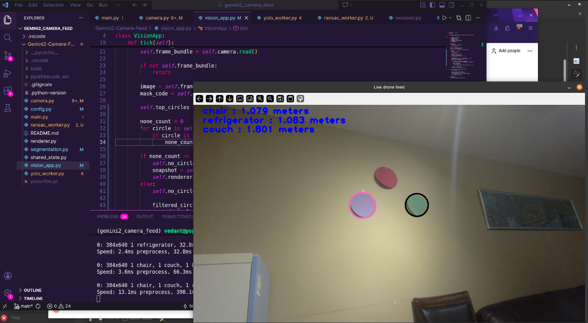

# Gemini2 Camera Feed – Vision Pipeline

Real-time vision pipeline for the **AEAC Fire Reconnaissance UAS Competition**, built around the **Orbbec Gemini 2 depth camera**.  
The system performs **color circle detection**, **depth alignment**, and **plane estimation** under real-world lighting and compression.



---

## What This Does

- Streams aligned color and depth from Orbbec Gemini 2  
- Detects colored circular targets using HSV segmentation  
- Estimates distance to detected objects  
- Fits dominant planes using RANSAC  
- Displays live overlays and debug views  

Designed to be robust to:
- MJPG compression
- Auto-exposure and white balance
- Lighting variation
- USB reconnects and transient frame failures

---

## High-Level Pipeline

1. Camera
   - Synchronized color and depth streams
   - Depth aligned to color
   - Automatic retry on frame failures

2. Color Segmentation
   - HSV thresholding per color
   - Gaussian blur for stability
   - Morphological operations (OPEN/CLOSE)

3. Circle Detection
   - Contour extraction
   - Geometric filtering (area, radius, solidity, roundness)
   - Rejects noise and irregular blobs

4. Plane Estimation
   - Depth to 3D point conversion
   - RANSAC plane fitting
   - Convex hull of inliers

5. Visualization
   - Live feed with overlays
   - Mask debug windows
   - Distance annotations

---

## Repository Structure

.
├── main.py                # Entry point
├── camera.py              # Orbbec camera interface and frame handling
├── segmentation.py        # HSV masking and circle detection
├── ransac_worker.py       # Plane estimation using RANSAC
├── vision_app.py          # Main application loop
├── renderer.py            # Visualization and overlays
├── shared_state.py        # Thread-safe shared state
├── yolo_worker.py         # Optional YOLO landmark detection
├── config.py              # Tunable parameters
└── README.md
---

## Circle Detection Notes

- Not Hough-based
- Uses mask cleanup combined with contour geometry
- More robust to partial occlusion and noise
- Thresholds tuned for colored paper targets

Key techniques:
- HSV blur before thresholding
- Morphological CLOSE to fill gaps
- Morphological OPEN to remove speckle noise

---

## Running the Project

```bash
python main.py
```

Controls:

q or ESC to quit

Requirements:

Orbbec Gemini 2 camera

USB 3 port (direct connection recommended)

No other process using /dev/video*
